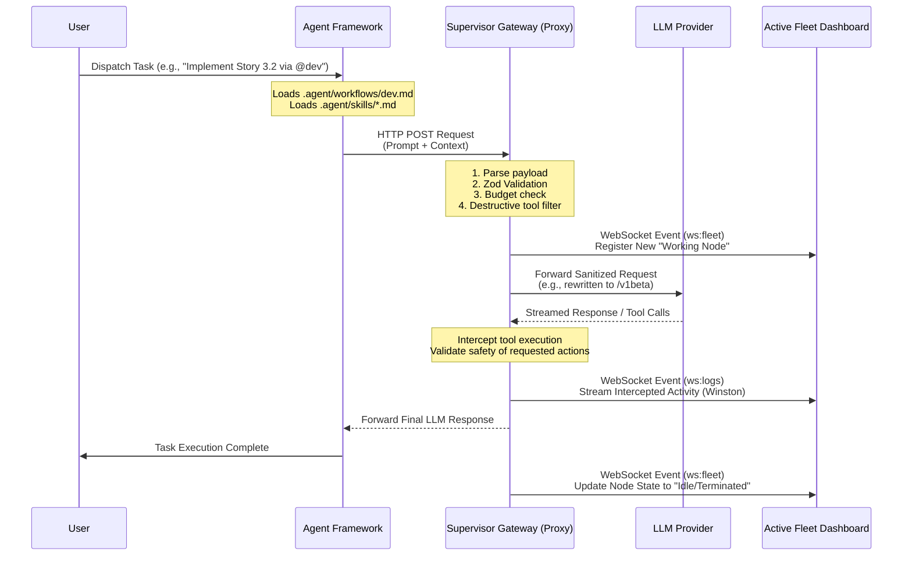

# Dispatch Architecture Pipeline & Workflow

This document outlines the end-to-end architecture and workflow of the Autonomous CLI Orchestration system when delegating tasks using the **Dispatch** mechanism. It illustrates how a task request flows from the user, through the Zero-Trust Supervisor Gateway, out to the external LLM providers, and back to the active Active Fleet Dashboard.

## 1. System Components Overview

- **User/Developer**: Initiates tasks via the Gemini CLI or Antigravity agents.
- **Agent Framework (BMad / Antigravity)**: Encapsulates the specific skills, workflows, and prompts required to execute the task (e.g., `@dev`, `@architect`).
- **Zero-Trust Supervisor Gateway (Backend Proxy)**: The central Node.js Express server running on `127.0.0.1:8080`. It intercepts, validates, and logs all traffic.
- **LLM Provider (External)**: Models like Google Gemini, Anthropic Claude, or OpenAI GPT executing the natural language prompt and generating tool calls.
- **Active Fleet Dashboard (Frontend)**: Real-time Next.js application running on Port `3000`, monitoring the working nodes and intercepted tool calls via WebSockets.

---

## 2. Dispatch Workflow Diagram

Below is a visual representation of the end-to-end lifecycle when dispatching a task:

---

## 3. Step-by-Step Processing Pipeline

### Phase 1: Initiation & Context Assembly (Local)
1. **Trigger**: The developer dispatches a command via the CLI (e.g., `gemini -p "Fix the login bug"`).
2. **Context Injection**: The Local framework parses the request against `.agent/skills/` (Progressive Disclosure) and `.agent/workflows/` to bundle necessary context, instructions, and limits.
3. **Environment Redirection**: The CLI is configured via `$env:GEMINI_API_BASE_URL="http://127.0.0.1:8080/v1"` causing its outbound HTTP requests to route directly to the local Proxy instead of the global API endpoint.

### Phase 2: Interception & Validation (Supervisor Gateway)
1. **Ingestion**: The proxy server captures the JSON payload.
2. **Schema Validation**: Fast robust parsing and validation using `zod` to ensure payload integrity.
3. **Safety Gateway**: Identifies dangerous or disallowed tools (e.g., destructive system commands) and blocks them. Rate limiting, anti-ban jitter, and token tracking are applied.
4. **Telemetry Emission**: Winston logs an `initialization` event. The Proxy pushes a WebSocket update (`fleet_sync` / `agent_update`) to the **Active Fleet Dashboard**, materializing the agent visually as a **Working Node** matrix tile.

### Phase 3: External LLM Execution
1. **Network Routing**: The proxy securely forwards the sanctioned payload to the appropriate LLM provider URL (e.g., Google API `/v1beta`).
2. **Processing**: The model evaluates the task and generates reasoning and tool call requirements.

### Phase 4: Active Loop & Live Monitoring
1. **Streaming Proxy**: As the LLM streams its response back, the Zero-Trust Gateway reads the chunks in transit.
2. **Tool Execution Checks**: When the LLM requests a local tool (e.g., read a file, run a bash script), the Proxy intercepts it.
3. **Live UI Updates**: Winston logger fires off granular events. These are pushed down the websocket to the Dashboard, which populates the **Interceptions Tab**, updating the visual status of the agent (e.g., "Executing script", "Reading DB").

### Phase 5: Termination & Cleanup
1. **Final Handoff**: The LLM successfully completes the loop. The proxy forwards the final success message back to the developer's CLI.
2. **State Teardown**: The proxy emits a teardown event. The dashboard updates the specific Working Node status to `Idle`, keeping history accessible for post-analysis but marking the execution lock as released.
