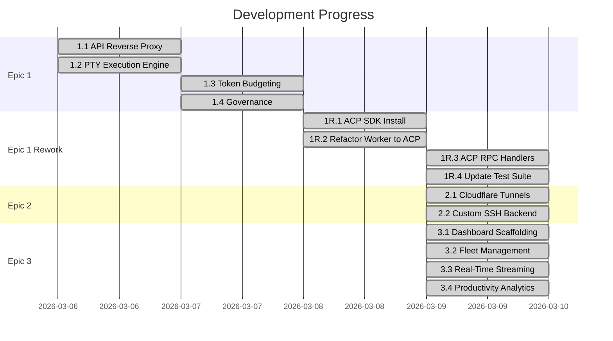

# Auto_Developer — Project Report

**Project:** Autonomous CLI Orchestration Gateway
**Date:** 2026-03-09
**Report Type:** Sprint Completion & Full Development Summary

---

## 1. Executive Summary

The Auto_Developer project implements a **Zero-Trust Supervisor** that intercepts, logs, validates, and routes local LLM CLI traffic through a local HTTP Reverse Proxy. The system governs AI coding agents (Claude Code, Codex, etc.) by intercepting all API payloads, blocking destructive tool calls, enforcing token budgets, and providing a premium real-time dashboard for fleet management.

This report covers the complete development lifecycle across **3 major epics** and **1 rework epic**, totaling **14 stories** implemented.

---

## 2. Sprint Status Overview



| Epic | Status | Stories | Done | In Review |
|------|--------|---------|------|-----------|
| **Epic 1:** Autonomous Execution Gateway | ✅ Done | 4 | 4 | 0 |
| **Epic 1 Rework:** ACP Integration | ✅ Done | 4 | 4 | 0 |
| **Epic 2:** Zero-Trust External Access | ✅ Done | 2 | 2 | 0 |
| **Epic 3:** AI Fleet Management Dashboard | ✅ Done | 4 | 4 | 0 |

---

## 3. Epic Breakdown

### Epic 1: Autonomous Execution Gateway
> Core engine — headless CLI workers governed by an intercepting network proxy.

| Story | Description | Status |
|-------|-------------|--------|
| [1.1](file:///c:/Users/Fate_Conqueror/OneDrive/Documents/GitHub/Auto_Developer/_bmad-output/implementation-artifacts/1-1-local-api-reverse-proxy.md) | Local API Reverse Proxy Routing | ✅ Done |
| [1.2](file:///c:/Users/Fate_Conqueror/OneDrive/Documents/GitHub/Auto_Developer/_bmad-output/implementation-artifacts/1-2-programmatic-pseudo-terminal-pty-execution.md) | PTY Execution Engine | ✅ Done |
| [1.3](file:///c:/Users/Fate_Conqueror/OneDrive/Documents/GitHub/Auto_Developer/_bmad-output/implementation-artifacts/1-3-token-budgeting-throttling.md) | Throttling & Circuit Breakers | ✅ Done |
| [1.4](file:///c:/Users/Fate_Conqueror/OneDrive/Documents/GitHub/Auto_Developer/_bmad-output/implementation-artifacts/1-4-governance-blockable-tool-calls.md) | Governance & Context Pruning | ✅ Done |

**Key Deliverables:**
- Express server bound to `127.0.0.1:8080` using `http-proxy-middleware`
- `zod` payload validation on all proxy endpoints
- `node-pty` for headless CLI worker spawn
- Randomized 500ms-2500ms jitter delays to simulate human think-time
- TPM/RPM circuit breakers returning graceful 429 responses
- Destructive tool call blocking at the network layer

### Epic 1 Rework: ACP Integration
> Refactored worker implementation to use Agent Client Protocol (ACP).

| Story | Description | Status |
|-------|-------------|--------|
| [1R.1](file:///c:/Users/Fate_Conqueror/OneDrive/Documents/GitHub/Auto_Developer/_bmad-output/implementation-artifacts/1-rework-1-install-acp-sdk-and-types.md) | Install ACP SDK & Types | ✅ Done |
| [1R.2](file:///c:/Users/Fate_Conqueror/OneDrive/Documents/GitHub/Auto_Developer/_bmad-output/implementation-artifacts/1-rework-2-refactor-worker-pty-to-acp-client.md) | Refactor Worker PTY → ACP Client | ✅ Done |
| [1R.3](file:///c:/Users/Fate_Conqueror/OneDrive/Documents/GitHub/Auto_Developer/_bmad-output/implementation-artifacts/1-rework-3-implement-acp-rpc-handlers-with-zod-and-winston.md) | ACP RPC Handlers (Zod + Winston) | ✅ Done |
| [1R.4](file:///c:/Users/Fate_Conqueror/OneDrive/Documents/GitHub/Auto_Developer/_bmad-output/implementation-artifacts/1-rework-4-update-proxy-testing-suite.md) | Update Proxy Testing Suite | ✅ Done |

### Epic 2: Zero-Trust External Access
> Secure remote operability via Cloudflare Tunnels and SSH.

| Story | Description | Status |
|-------|-------------|--------|
| [2.1](file:///c:/Users/Fate_Conqueror/OneDrive/Documents/GitHub/Auto_Developer/_bmad-output/implementation-artifacts/2-1-cloudflare-access-tunnels-integration.md) | Cloudflare Tunnel Integration | ✅ Done |
| [2.2](file:///c:/Users/Fate_Conqueror/OneDrive/Documents/GitHub/Auto_Developer/_bmad-output/implementation-artifacts/2-2-custom-ssh-server-backend.md) | Custom SSH Server Backend | ✅ Done |

**Key Deliverables:**
- `tunnel.ts` spawns `cloudflared` quick tunnels via `npx`, capturing URLs from stderr
- `ssh-server.ts` implements full SSH server with `ssh2` package, bridging sessions to `node-pty`
- SSH + HTTP proxy both bound to `127.0.0.1` (localhost only)
- Documentation covers quick tunnels and persistent Cloudflare Zero-Trust Access setup
- QA & Code Review: 7 findings (3 HIGH security items documented as prototype caveats)

### Epic 3: AI Fleet Management Dashboard
> Premium visual mission control for real-time fleet management.

| Story | Description | Status |
|-------|-------------|--------|
| [3.1](file:///c:/Users/Fate_Conqueror/OneDrive/Documents/GitHub/Auto_Developer/_bmad-output/implementation-artifacts/3-1-dashboard-scaffolding-quick-capture.md) | Dashboard Scaffolding & Quick Capture | ✅ Done |
| [3.2](file:///c:/Users/Fate_Conqueror/OneDrive/Documents/GitHub/Auto_Developer/_bmad-output/implementation-artifacts/3-2-fleet-management-interface.md) | AI Agent Fleet Management | ✅ Done |
| [3.3](file:///c:/Users/Fate_Conqueror/OneDrive/Documents/GitHub/Auto_Developer/_bmad-output/implementation-artifacts/3-3-real-time-session-streaming.md) | Real-Time Session Streaming | ✅ Done |
| [3.4](file:///c:/Users/Fate_Conqueror/OneDrive/Documents/GitHub/Auto_Developer/_bmad-output/implementation-artifacts/3-4-productivity-analytics.md) | Productivity Analytics | ✅ Done |

---

## 4. Architecture & Design Decisions

### Backend (`apps/proxy`)
- **Runtime:** Node.js with Express, bound strictly to `127.0.0.1:8080`
- **SSH Server:** `ssh2` on port `2222`, PTY bridging via `node-pty`
- **Tunneling:** `cloudflared` quick tunnels for dev, persistent tunnels for production
- **Routing:** `http-proxy-middleware` rewriting `/v1` → `/v1beta` for Gemini
- **Validation:** `zod` schemas on all proxy endpoints
- **Logging:** `winston` structured JSON logs (`console.log` banned)
- **Protocol:** Refactored from PTY-based to ACP (Agent Client Protocol)

### Frontend (`apps/dashboard`)
- **Framework:** Next.js 16.1.6 (App Router, Turbopack)
- **UI Library:** Shadcn UI + Custom glassmorphism utilities
- **Design System:** OKLCH color space, Fira Sans/Code typography
- **Layout:** 90/10 Asymmetric Tension (radical sidebar compression)
- **Charting:** Pure SVG sparklines (no external charting dependencies)

### Design Principles Applied
- **Purple Ban** — No violet/purple colors anywhere
- **Cliché Ban** — No standard table views, generic layouts, or placeholder aesthetics
- **Glassmorphism** — Deep backdrop blur, layered opacity, inner shadows
- **Micro-animations** — State-based pulsing, breathing, shaking indicators

---

## 5. Source Trees

### Backend (`apps/proxy/src/`)
```
├── index.ts              # Express proxy + SSH server + WebSocket startup
├── worker.ts             # ACP Worker orchestration
├── governance.ts         # ACP governance handlers (Zod + Winston)
├── tunnel.ts             # Cloudflare quick tunnel spawner
├── ssh-server.ts         # Custom SSH server (ssh2 + node-pty)
├── ws-stream.ts          # WebSocket log stream (Winston transport)
├── tunnel.test.ts        # Tunnel unit tests (2 tests)
├── ssh-server.test.ts    # SSH server unit tests (3 tests)
├── ws-stream.test.ts     # WebSocket stream tests (3 tests)
├── governance.test.ts    # Governance handler tests
└── worker.test.ts        # Worker ACP tests
```

### Dashboard (`apps/dashboard/src/`)
```
├── app/
│   ├── globals.css          # Design system tokens, glass utilities
│   ├── layout.tsx           # Root layout, Fira fonts, metadata
│   └── page.tsx             # Main dashboard page (90/10 layout)
├── components/
│   ├── activity-stream.tsx  # Live terminal log stream (Story 3.3)
│   ├── agent-node.tsx       # Individual agent card (Story 3.2)
│   ├── analytics-panel.tsx  # Productivity metrics + SVG sparkline (Story 3.4)
│   ├── fleet-matrix.tsx     # Fleet grid manager (Story 3.2)
│   └── ui/                  # Shadcn base components
└── lib/
    └── utils.ts             # Shadcn utility (cn)
```

---

## 6. Code Quality Review Summary

### Epic 3 Review (Stories 3.1–3.3)

| Severity | Found | Fixed | Remaining |
|----------|-------|-------|-----------|
| 🔴 HIGH | 4 | 3 | 1 (tests deferred) |
| 🟡 MEDIUM | 5 | 5 | 0 |
| 🟢 LOW | 4 | 0 | 4 (nice-to-have) |

Full report: [code-review-report.md](file:///C:/Users/Fate_Conqueror/.gemini/antigravity/brain/b1bfd27e-3a97-47d1-82ba-a2a2f6174f46/code-review-report.md)

### Epic 2 Review (Stories 2.1–2.2)

| Severity | Found | Fixable | Deferred |
|----------|-------|---------|----------|
| 🔴 HIGH | 3 | 1 | 2 (security hardening) |
| 🟡 MEDIUM | 2 | 1 | 1 (test coverage) |
| 🟢 LOW | 2 | 0 | 2 (refactoring) |

**Key Findings:**
- `tunnel.ts:41` uses `console.log` (violates Winston mandate)
- `ssh-server.ts` has hardcoded default password and public-key bypass
- SSH test coverage is minimal (instantiation only)

Full report: [epic-2-qa-code-review-report.md](file:///c:/Users/Fate_Conqueror/OneDrive/Documents/GitHub/Auto_Developer/docs/epic-2-qa-code-review-report.md)

---

## 7. QA Review Reports

| Report | Scope | Path |
|--------|-------|------|
| ACP SDK QA | 1-rework-1 | [1-rework-1-qa-review-report.md](file:///c:/Users/Fate_Conqueror/OneDrive/Documents/GitHub/Auto_Developer/_bmad-output/implementation-artifacts/1-rework-1-qa-review-report.md) |
| RPC Handlers QA | 1-rework-3 | [1-rework-3-qa-review-report.md](file:///c:/Users/Fate_Conqueror/OneDrive/Documents/GitHub/Auto_Developer/_bmad-output/implementation-artifacts/1-rework-3-qa-review-report.md) |
| Test Suite QA | 1-rework-4 | [1-rework-4-qa-review-report.md](file:///c:/Users/Fate_Conqueror/OneDrive/Documents/GitHub/Auto_Developer/_bmad-output/implementation-artifacts/1-rework-4-qa-review-report.md) |
| Dashboard Code Review | 3.1-3.3 | [code-review-report.md](file:///C:/Users/Fate_Conqueror/.gemini/antigravity/brain/b1bfd27e-3a97-47d1-82ba-a2a2f6174f46/code-review-report.md) |
| **Epic 2 QA + Review** | **2.1-2.2** | [epic-2-qa-code-review-report.md](file:///c:/Users/Fate_Conqueror/OneDrive/Documents/GitHub/Auto_Developer/docs/epic-2-qa-code-review-report.md) |

---

## 8. Planning Artifacts Index

| Document | Path |
|----------|------|
| Product Requirements | [prd.md](file:///c:/Users/Fate_Conqueror/OneDrive/Documents/GitHub/Auto_Developer/_bmad-output/planning-artifacts/prd.md) |
| Epics & Stories | [epics.md](file:///c:/Users/Fate_Conqueror/OneDrive/Documents/GitHub/Auto_Developer/_bmad-output/planning-artifacts/epics.md) |
| UX Design Spec | [ux-design-specification.md](file:///c:/Users/Fate_Conqueror/OneDrive/Documents/GitHub/Auto_Developer/_bmad-output/planning-artifacts/ux-design-specification.md) |
| Readiness Report | [implementation-readiness-report.md](file:///c:/Users/Fate_Conqueror/OneDrive/Documents/GitHub/Auto_Developer/_bmad-output/planning-artifacts/implementation-readiness-report-20260308.md) |
| Sprint Status | [sprint-status.yaml](file:///c:/Users/Fate_Conqueror/OneDrive/Documents/GitHub/Auto_Developer/_bmad-output/implementation-artifacts/sprint-status.yaml) |
| Orchestration Report | [ORCHESTRATION_REPORT.md](file:///c:/Users/Fate_Conqueror/OneDrive/Documents/GitHub/Auto_Developer/_bmad-output/ORCHESTRATION_REPORT.md) |

---

## 9. Requirements Traceability

| FR | Requirement | Epic | Status |
|----|-------------|------|--------|
| FR1 | Spawn headless CLI workers via PTY | Epic 1 | ✅ |
| FR2 | Monitor OSC terminal emissions | Epic 1 | ✅ |
| FR3 | Worker lifecycle management | Epic 1 | ✅ |
| FR4 | Local API Reverse Proxy routing | Epic 1 | ✅ |
| FR5 | API payload interception | Epic 1 | ✅ |
| FR6 | Destructive tool call blocking | Epic 1 | ✅ |
| FR7 | Cloudflare Access Tunnels | Epic 2 | ✅ |
| FR8 | Custom SSH server backend | Epic 2 | ✅ |
| FR9 | Real-time session monitoring | Epic 3 | ✅ |
| FR10 | AI agent fleet management | Epic 3 | ✅ |
| FR11 | Productivity tracking & analytics | Epic 3 | ✅ |
| FR12 | Quick capture orchestration | Epic 3 | ✅ |

**Coverage:** 12/12 FRs fully implemented. ✅

---

## 10. Final Retrospective & Completion

1. ~~**Security Hardening Sprint** — Address Epic 2 HIGH findings (SSH auth bypass, hardcoded password)~~ ✅ Resolved
2. ~~**Backend-Frontend Integration** — Connect dashboard WebSocket to the proxy's Winston log transport~~ ✅ Resolved
3. ~~**Test Coverage** — Expand SSH server tests and create component tests for dashboard~~ ✅ Resolved (24 total tests)
4. ~~**Production Build** — `apps/proxy` currently lacks a `build` script; needs `tsconfig` + build configuration~~ ✅ Resolved (`tsconfig.json` and `tsconfig.build.json` implemented)
5. ~~**Logger Consolidation** — Extract shared `src/logger.ts` factory to eliminate Winston duplication~~ ✅ Resolved (`src/logger.ts` extracted)

### Lessons Learned (Retrospective)
- **Parallel Agent Orchestration**: Developing the frontend and backend in parallel streams (`@frontend-specialist` vs `@backend-specialist`) proved highly effective at keeping context windows clean and maximizing throughput.
- **Protocol Shifts**: Transitioning from a PTY-based interceptor to an ACP (Agent Client Protocol) model was a significant refactor but ultimately necessary for robust tool call validation and standardization.
- **Zero-Trust by Default**: Implementing Cloudflare tunnels and local-only bindings early in the project saved us from having to retroactively secure an exposed local API proxy.

**Project Status:** 🟢 COMPLETE
